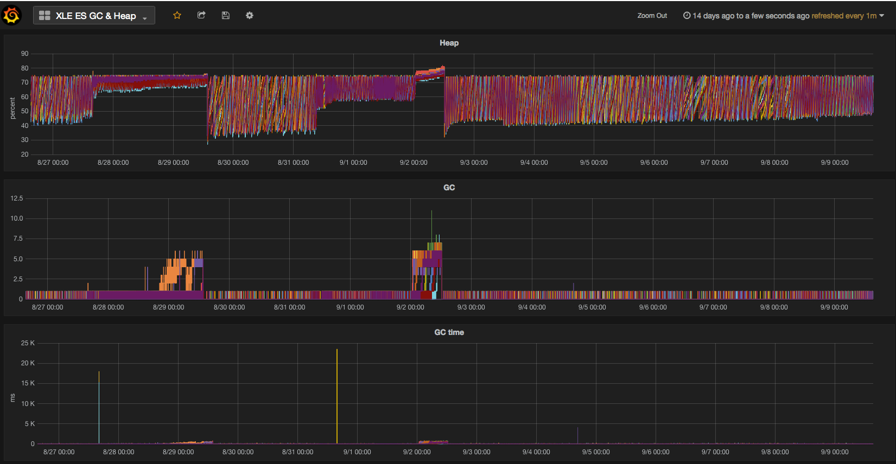

Elasticsearch at ViaSat

<xavier.lange@viasat.com>/<xrlange@tureus.com>

<hunter.marshall@viasat.com>

---

About Xavier

  * Independent software consultant
  * Years of DevOps experience
  * A year of Elasticsearch experience

---

The Project

  * Enterprise Log Aggregation
  * Gather information from
    * Network equipment
    * Application servers
    * Self-service logging for other users
  * Logstash
  * Kibana/Kopf/Head/HQ
  * Graphite/Grafana2

---

The Project: Stats at a glance

  * 13 data nodes (elasticsearch)
  * 7 forwarders (logstash)
  * 1 redis server
  * 1 monitor server (nginx/single page apps/etc)
  * 1 stats server (graphite)
  * 2MB/s data (4k + log msg/s)
    * Bursts up to 20k msg/s
  * 11TB storage used

---

Initial Architecture

  * VMWare ESXi
    * Manually installed Elasticsearch
    * zen discovery
    * Basic puppet for config installation

  * Had performance issues
  * Lack of monitoring

---

Today's Architecture

  * OpenStack
    * Wealth of new resources
    * Used familiar tooling (chef/knife/fog)
    * Static discovery
    * Growing pains of OpenStack installation (not ES related)

---

Many, many iterations

  * Data loss from bad base images
  * Change installed JVM
  * Change Elasticsearch versions
  * Bad reactions to shard storms
  * Exploring opensource monitoring tools
  * Significant effort on metrics
  * Changed memory profile of instances
  * Changed block devices, host to cinder
  * Provisioning and config automation, new node in < 5 minutes

---

Data loss from bad base images

  * Test out restarting your servers, one at a time, just to make sure you can

---

Change installed JVM

The Oracle JVM 1.8 is the best, hands down.

Best use of the heap and best handling of memory pressure.

---

How we look at the heap

---

Change Elasticsearch versions

Upgraded to 1.7.1

  * Cluster used to take forever to stabilize
  * Issues ingesting data when shard copying was underway

---

Bad reactions to shard storms

Wanted to intervene manually and disable behavior

Just have to be patient and let it settle down on its own.

---

Exploring opensource monitoring tools

  * CollectD: CPU/Memory/Disk/Network metrics
  * Graphite: metric storage and querying
  * Grafana2: graphing and dashboards
  * es2graphite: metrics in grapite format
  * Free NewRelic monitoring for nice graphs and notifications
    * 24 hrs at 60s resolution free
    * Sales guys will not chase you down

---

Significant effort on metrics

  * Answers all the questions of
    * What's happened in the last 5 minutes
    * Which host is acting up

---

Changed memory profile of instances

  * Started with multiple 8GB instances
    * OOM killer
  * Went to 16GB instances
    * Less OOM killer
  * Went to 32GB instances
    * No more OOM killer

---

Changed memory profile of instances (cont)

We also changed ES/JVM verions (1.7.1/1.8)

Not definitive proof of anything in particular but now part of our mythos.

---

Changed block devices, host to cinder

  * Slow host disks caused high IOWAIT
    * One bad disk affected data ingestion across cluster
  * Cinder gave access to larger data storage
    * More retention
    * Higher latency
    * Most consistent performance and no IOWAIT storms

---

Provisioning and config automation, new node in < 5 minutes

  * I'm most comfortable with Chef
    * Custom Thorfile
      * Nova API calls for new nodes
      * Bootstrap Chef
      * Inject elasticsearch role
      * Join cluster
  * Official chef recipes have worked well
    * Not quite compatible with Shield
  * Helps keep the cluster in a consistent state

---

Roles (1/2)

  * elasticsearch: Elasticsearch master/data nodes
  * monitor: Elasticsearch no-master/no-data node
    * enables outwardly accessible HTTP
      * nginx load balance
    * automates installation of HTTP tools
      * Kopf (our favorite)
      * Grafana2 (our favorite)
      * Kibana4 (becoming our favorite)
      * Kibana3 (most accessible to new users)

---

Roles (2/2)

  * stats
    * dedicated graphite host
  * forwarders
    * logstash 1.4, we run about 7 of them
  * redis
  * rsyslog

---

A note on Redis

  * Key component for back pressure in system
    * Tricky to administer
    * Easy to inspect and use
    * 8GB of storage
    * works out to a few hours of wiggle room in practice

---

A note on Rsyslog

  * Fast
  * Weird configuration language
  * Easy to split/filter streams to different dests
  * Our main entrypoint for logs

---

Provisioning and config automation, new node in < 5 minutes

  * Automation is key
  	* Servers hold large amounts of data so cannot be thrown away
  * Maintain an island
    * Access controls
    * Service discovery

---

Future

  * Docker, if only to move away from chef
    * Managing volumes will still require some tooling
      * ansible?
      * Kubernetes?
  * Heka for message routing
    * Fast owing to go/protocol buffers
    * Extensible (big learning curve)
    * Lua with LPEGs are powerful and fast
  * More cinder (more retention)
  * More nodes/replicas (more durability)
